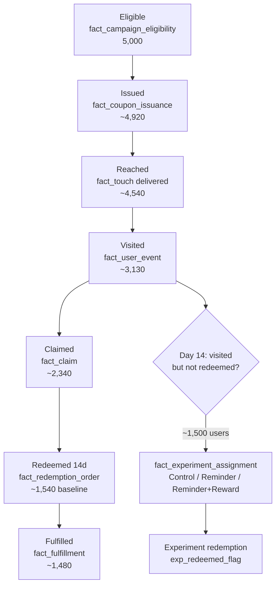
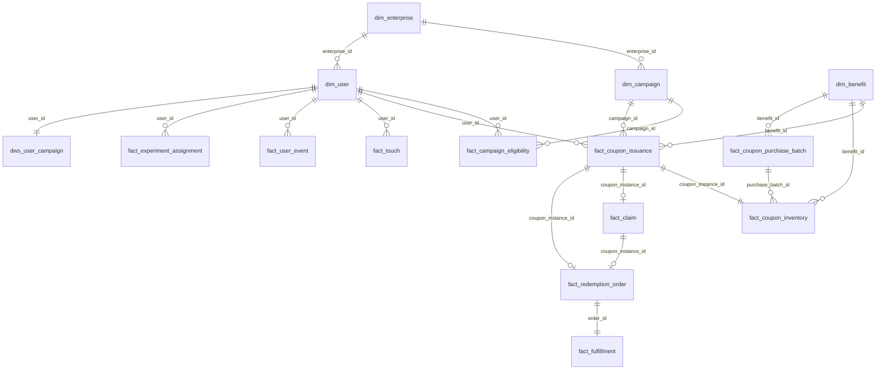

# Data Schema — Corporate Benefits Growth Demo

Visual reference for the **15 DuckDB tables** in `data/benefits.duckdb` (generated by `src/generate_data.py`).

> All data is **synthetic**. Row counts below are from the default seed (`--seed 9`).

---

## Three layers at a glance

```text
┌─────────────────────────────────────────────────────────────────┐
│  DIM  (who / what)          4 tables   enterprise, campaign,    │
│                                        user, benefit catalog    │
├─────────────────────────────────────────────────────────────────┤
│  FACT (what happened)      10 tables   eligibility → issuance → │
│                                        touch → events → claim → │
│                                        redeem → fulfill +       │
│                                        inventory + experiment   │
├─────────────────────────────────────────────────────────────────┤
│  DWS  (analysis-ready)      1 table    one row per user ×       │
│                                        campaign (funnel flags)  │
└─────────────────────────────────────────────────────────────────┘
```

**Start here for analysis:** `dws_user_campaign` — most funnel / cohort / segmentation queries need no joins.

---

## Business timeline → tables

```text
Day -10   Purchase coupons          fact_coupon_purchase_batch
          Stock in warehouse        fact_coupon_inventory

Day 0     Campaign starts           dim_campaign
          HR eligibility list       fact_campaign_eligibility
          Issue coupon to user      fact_coupon_issuance
          First notification        fact_touch (touch_type = 首次通知)

Day 0–14  Baseline window           fact_user_event, fact_claim,
          (14-day redemption rate)  fact_redemption_order (baseline)

Day 7     Routine reminder          fact_touch (touch_type = 常规提醒)

Day 14    Experiment assignment     fact_experiment_assignment  ← separate table!
          Reminder / Reward sends   fact_touch (experiment_id set; Control has NONE)

Day 14–28 Experiment window         exp_redeemed_flag in dws_user_campaign

Day 45    Coupon expiry             dim_campaign.redemption_deadline
```

---

## User funnel (distinct `user_id`)



**Inventory funnel** (separate grain: `coupon_instance_id`) lives in `fact_coupon_inventory`:
`purchased → assigned → claimed → redeemed`.

---

## Entity-relationship diagram



---

## Table catalog

### Dimension tables (`dim_*`)

| Table | Grain | Primary key | ~Rows | What one row means |
|-------|-------|-------------|------:|--------------------|
| `dim_enterprise` | Enterprise | `enterprise_id` | 1 | One B2B client (masked name, industry, settlement model) |
| `dim_campaign` | Campaign | `campaign_id` | 1 | One benefits campaign (dates, budget, target headcount) |
| `dim_user` | User | `user_id` | 5,000 | One employee (dept, region, historical activity segment) |
| `dim_benefit` | Benefit SKU | `benefit_id` | 6 | One coupon product (face value, cost, refundable flag) |

### Fact tables (`fact_*`)

| Table | Grain | Primary key | ~Rows | What one row means |
|-------|-------|-------------|------:|--------------------|
| `fact_campaign_eligibility` | User × campaign | `user_id` + `campaign_id` | 5,000 | HR says this user can participate |
| `fact_coupon_issuance` | Coupon instance | `coupon_instance_id` | 5,000 | One coupon issued (or failed) to a user |
| `fact_touch` | One message send | `touch_id` | 10,000 | One notification attempt (first / routine / experiment) |
| `fact_user_event` | One app event | `event_id` | 11,700 | Page view, benefit view, or click-claim |
| `fact_claim` | One claim action | `claim_id` | 2,580 | User claims coupon into wallet |
| `fact_redemption_order` | One redemption order | `order_id` | 2,040 | User redeems coupon (settlement $) |
| `fact_fulfillment` | One fulfillment | `fulfillment_id` | 2,040 | Supplier delivers code / service |
| `fact_coupon_purchase_batch` | Purchase batch | `purchase_batch_id` | 12 | Upfront buy from supplier |
| `fact_coupon_inventory` | Coupon instance | `coupon_instance_id` | 5,570 | Stock status: available / assigned / claimed / redeemed |
| `fact_experiment_assignment` | User × experiment | `experiment_id` + `user_id` | 1,500 | Random group at Day 14 (**includes Control**) |

### Wide table (`dws_*`)

| Table | Grain | Primary key | ~Rows | What one row means |
|-------|-------|-------------|------:|--------------------|
| `dws_user_campaign` | User × campaign | `user_id` + `campaign_id` | 5,000 | Funnel flags + experiment fields + $ + fulfillment flags |

Key `dws_user_campaign` columns:

| Column group | Examples |
|--------------|----------|
| User profile | `department_group`, `region`, `activity_segment`, `historical_*` |
| Funnel flags | `eligible_flag` → `issued_flag` → `reached_flag` → `visited_flag` → `claimed_flag` → `redeemed_14d_flag` |
| Experiment | `experiment_id`, `group_name`, `exp_redeemed_flag` |
| Finance / guardrails | `settlement_amount`, `supplier_cost`, `reward_cost`, `fulfilled_flag`, `complaint_flag` |

---

## Analysis grains (do not mix)

| Question | Grain key | Main table(s) |
|----------|-----------|---------------|
| User funnel | `distinct user_id` | `dws_user_campaign` |
| Coupon / inventory | `coupon_instance_id` | `fact_coupon_inventory`, `fact_coupon_issuance` |
| Orders / revenue | `order_id` | `fact_redemption_order` |
| Experiment lift | `experiment_id × user_id` | `fact_experiment_assignment` + `dws_user_campaign` |
| Supplier quality | `order_id` | `fact_fulfillment` + `fact_redemption_order` |

---

## Standard join patterns

### 1. Funnel & cohort (usually **no join**)

```sql
SELECT SUM(issued_flag), SUM(visited_flag), SUM(redeemed_14d_flag)
FROM dws_user_campaign;
```

### 2. Experiment analysis

```sql
SELECT e.group_name,
       COUNT(*) AS n,
       AVG(d.exp_redeemed_flag) AS redeem_rate
FROM fact_experiment_assignment e
JOIN dws_user_campaign d ON e.user_id = d.user_id
GROUP BY 1;
```

### 3. Redemption speed (days since campaign start)

```sql
SELECT d.activity_segment,
       DATE_DIFF('hour', c.start_time, o.redemption_time) / 24.0 AS days_to_redeem
FROM dws_user_campaign d
JOIN fact_redemption_order o
  ON d.user_id = o.user_id AND o.redemption_status = 'success'
CROSS JOIN dim_campaign c
WHERE d.redeemed_14d_flag = 1;
```

### 4. Fulfillment by benefit / supplier

```sql
SELECT d.benefit_type, f.supplier_id, COUNT(*) AS orders
FROM fact_redemption_order o
JOIN fact_fulfillment f ON o.order_id = f.order_id
JOIN dws_user_campaign d ON o.user_id = d.user_id
GROUP BY 1, 2;
```

### 5. Inventory risk

```sql
SELECT i.benefit_id, d.refundable_flag, COUNT(*) AS un_redeemed
FROM fact_coupon_inventory i
JOIN dim_benefit d ON i.benefit_id = d.benefit_id
WHERE i.coupon_status IN ('available', 'assigned', 'claimed')
GROUP BY 1, 2;
```

### 6. Budget utilization (single campaign → `CROSS JOIN`)

```sql
SELECT ROUND(SUM(o.settlement_amount) * 100.0 / MAX(c.benefit_budget), 1) AS budget_pct
FROM fact_redemption_order o
CROSS JOIN dim_campaign c
WHERE o.redemption_status = 'success';
```

---

## Why `fact_experiment_assignment` is separate

**Assignment** (who is in which group) and **intervention** (whether a message was sent) are different events.

| Group | Intervention on Day 14 | Row in `fact_touch` with `experiment_id`? |
|-------|------------------------|-------------------------------------------|
| Control | Nothing sent | **No** |
| Reminder | Expiry reminder | Yes |
| Reminder+Reward | Reminder + ¥5 reward | Yes |

If you infer groups only from `fact_touch WHERE experiment_id IS NOT NULL`, **Control users vanish** (~500 missing). You cannot compute lift without a true control baseline.

```text
❌  SELECT group_name FROM fact_touch WHERE experiment_id = 'EXP001'
    → only Reminder + Reminder+Reward (~1,000 users)

✅  SELECT group_name FROM fact_experiment_assignment
    → Control + Reminder + Reminder+Reward (~1,500 users)
```

`fact_experiment_assignment` freezes the randomization at assignment time; `fact_touch` records execution of the treatment.

---

## Data-quality joins (see `analysis_funnel_cohort.py`)

| Check | Join |
|-------|------|
| Redeem before claim | `fact_redemption_order` JOIN `fact_claim` ON `coupon_instance_id` |
| Control received experiment message | `fact_touch` JOIN `fact_experiment_assignment` ON `user_id` |
| Orphan fulfillment | `fact_fulfillment` LEFT JOIN `fact_redemption_order` ON `order_id` |
| Event before campaign start | `fact_user_event` CROSS JOIN `dim_campaign` |

---

## Quick exploration

```bash
python src/generate_data.py --seed 9
duckdb data/benefits.duckdb -c "SHOW TABLES"
duckdb data/benefits.duckdb -c "DESCRIBE dws_user_campaign"
```

In Python:

```python
import duckdb
con = duckdb.connect("data/benefits.duckdb", read_only=True)
con.execute("SELECT * FROM dim_campaign").df()
```
